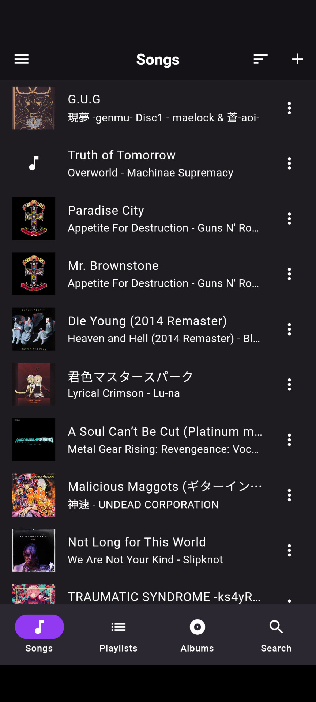
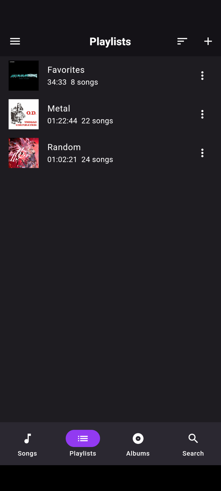
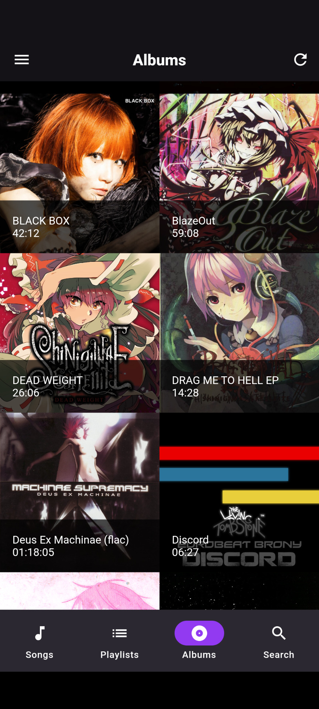
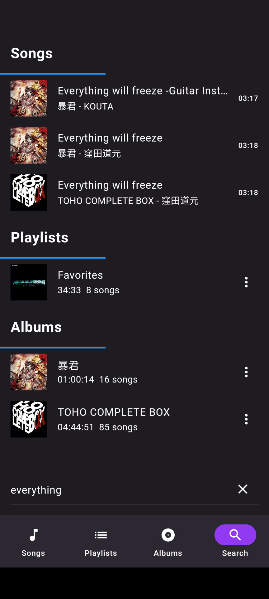

## dmus

A music player for Android written with Flutter.


<p align="center">
  
  
  
  
</p>


### Features

- Import and play a wide variety of audio formats
- Import music from Youtube URLs
- Detect embeded metadata and album art
- Detect `album.xyz` and `folder.xyz` for album art
- Album generation from embeded metadata
- Playlist creation / management
- Adjust audio playback speed
- Notifications for what is currently playing
- Dark theme / light theme
- Search
- Supports English, French, and Spanish translations (French / Spanish are probably not good though)


### Development

1. On Arch linux download `android-tools` package.
2. Enable wireless debugging in `Settings` > `System` >`Developer Settings` > `Wireless Debugging`
3. Pair your device `adb pair 192.168.1.49:35815`
4. Connect to your device `adb connect 192.168.1.49:35815`
5. Install to your device `adb install dmus/build/app/outputs/apk/debug/app-debug.apk`

### Building with Docker

The `Dockerfile` at the repo root builds a self-contained Android/Flutter build
environment (JDK 17, Android SDK platform 36, build-tools 33.0.2, NDK
27.0.12077973, and Flutter 3.38.9). It does **not** bake the app into the
image — you mount the `dmus/` project into the container and run Flutter
commands against it.

1. Build the image (from the repo root; requires internet access and can
   take several minutes / a few GB of downloads):

   ```sh
   docker build -t dmus-builder .
   ```

2. Build the APK by mounting the `dmus/` project directory to `/mnt`:

   ```sh
   docker run --rm -v "$(pwd)/dmus:/mnt" dmus-builder \
     bash -c "flutter pub get && flutter build apk --release"
   ```

   The finished APK is written back to
   `dmus/build/app/outputs/flutter-apk/app-release.apk` on the host, since
   it's inside the mounted volume.

3. For an interactive shell instead (useful for debugging or running
   `flutter doctor`, `flutter run`, etc.):

   ```sh
   docker run --rm -it -v "$(pwd)/dmus:/mnt" dmus-builder bash
   ```

**Notes**

- The release build isn't signed with a release key — `android/app/build.gradle`
  falls back to the debug signing config, so `app-release.apk` is
  debug-signed and fine for local installs/testing but not for a Play Store
  release.
- To speed up repeat builds, also mount Gradle/pub caches so they persist
  across runs, e.g. add `-v dmus-gradle-cache:/root/.gradle -v dmus-pub-cache:/root/.pub-cache`.
- The Android SDK platform/build-tools/NDK versions in the Dockerfile are
  pinned to match what Flutter 3.38.9 expects. If you bump `FLUTTER_VERSION`,
  you may also need to adjust `ANDROID_PLATFORM`, `ANDROID_BUILD_TOOLS`, and
  `NDK_VERSION` to match, otherwise Gradle will try to download the correct
  versions itself at build time (requiring network access inside the
  container).
