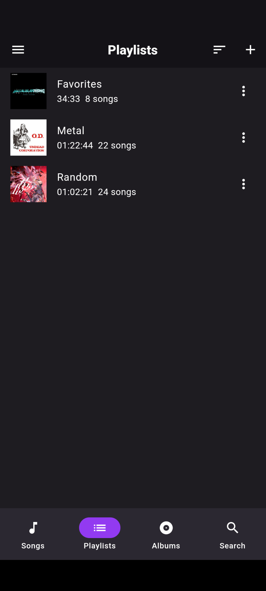
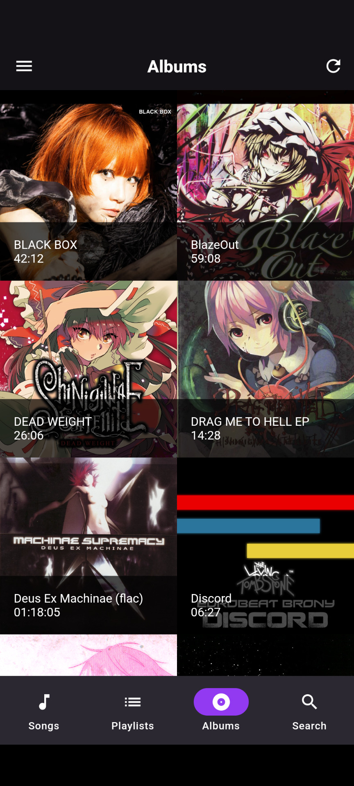

## dmus

A music player for Android written with Flutter.

  
  
  
  

### Features

- Import and play a wide variety of audio formats
- Import music from Youtube URLs
- Detect embeded metadata and album art
- Detect `album.xyz` and `folder.xyz` for album art
- Album generation from embeded metadata
- Playlist creation / management
- Adjust audio playback speed
- Notifications for what is currently playing
- Dark theme / light theme
- Search
- Supports English, French, and Spanish translations (French / Spanish are probably not good though)
